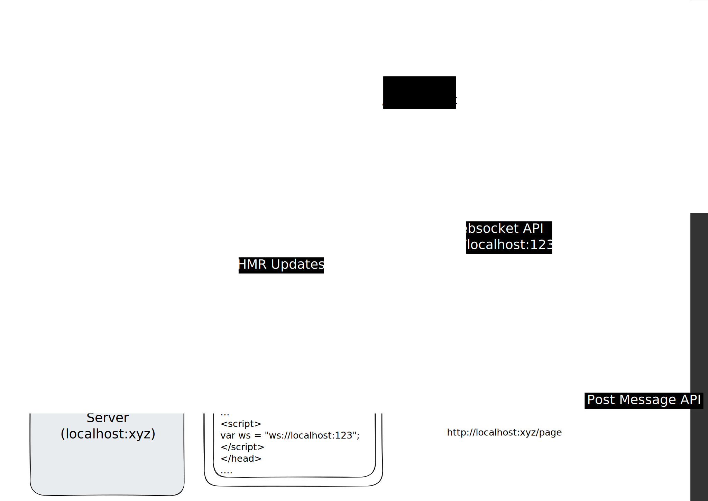

<div align="center">
  
  
  # JSX Tool Dev Server

  **A lightweight development server that bridges your browser and filesystem for real-time React component editing**

  [Documentation](https://jsxtool.com/docs/dev-server) • [Examples Repository](https://github.com/jsx-tool/jsx-tool-examples)

</div>

---

## Overview

JSX Tool Dev Server enables the JSX Tool Chrome extension to read and modify your React source code in real-time. It provides a WebSocket server scoped to your project directory, allowing secure file system access from the browser extension.

**For example integrations**, check out the [jsx-tool-examples repository](https://github.com/jsx-tool/jsx-tool-examples) which demonstrates various setups including React Router with Vite, Next.js, and more.

## Quick Start

### Vite Projects

For Vite projects, use the plugin-based approach:

```bash
# Install
npm i @jsx-tool/jsx-tool

# Add to vite.config.ts
import { jsxToolDevServer } from "@jsx-tool/jsx-tool/vite";

export default defineConfig({
  plugins: [
    react(),
    jsxToolDevServer(),
  ],
});
```

### Non-Vite Projects

For non-Vite projects, use the CLI with optional proxy:

```bash
# Initialize configuration
npx @jsx-tool/jsx-tool init

# Start dev server (with proxy)
npx @jsx-tool/jsx-tool start

# Or start without proxy
npx @jsx-tool/jsx-tool start --no-proxy
```

## CLI API

### `init`

Initialize JSX Tool configuration in your project. Call this from next to your package.json. !!!not your root package.json if a monorepo!!!

```bash
npx @jsx-tool/jsx-tool init [options]
```

**Options:**
- `-f, --from <path>` - Working directory (default: current directory)

**Interactive prompts:**
- Vite project detection
- Server port configuration
- Proxy enablement
- WebSocket port setup

**Creates:**
- `.jsxtool/rules.md` - Custom prompting rules (all projects)
- `.jsxtool/config.json` - Configuration file (non-Vite only)

### `start`

Start the JSX Tool development server.

```bash
npx @jsx-tool/jsx-tool start [options]
```

**Options:**

**Working Directory:**
- `-f, --from <path>` - Working directory (default: current directory)
- `--node-modules-dir <path>` - node_modules directory (auto-detected or defaults to working directory)
- `--additional-directories <paths>` - Comma-separated list of additional directories to watch

**Server Configuration:**
- `--server-port <port>` - Target server port (default: `4000`)
- `--server-host <host>` - Target server host (default: `localhost`)
- `--server-protocol <protocol>` - Target server protocol: `http` or `https` (default: `http`)

**Proxy Configuration:**
- `--proxy-port <port>` - Proxy server port (default: `3000`)
- `--proxy-host <host>` - Proxy server host (default: `localhost`)
- `--proxy-protocol <protocol>` - Proxy server protocol: `http` or `https` (default: `http`)
- `--no-proxy` - Disable proxy server

**WebSocket Configuration:**
- `--ws-port <port>` - WebSocket server port (default: `12021`)
- `--ws-host <host>` - WebSocket server host (default: `localhost`)
- `--ws-protocol <protocol>` - WebSocket protocol: `ws` or `wss` (default: `ws`)

**Development Options:**
- `--insecure` - Run dev server without signature check
- `--logging` - Enable logging
- `-d, --debug` - Enable debug logging

**Examples:**

```bash
# Start with default settings (reads from .jsxtool/config.json)
npx @jsx-tool/jsx-tool start

# Start without proxy
npx @jsx-tool/jsx-tool start --no-proxy

# Start with custom ports
npx @jsx-tool/jsx-tool start --server-port 3000 --proxy-port 4000

# Start in monorepo with explicit node_modules path
npx @jsx-tool/jsx-tool start --node-modules-dir ../../node_modules

# Start with additional directories to watch
npx @jsx-tool/jsx-tool start --additional-directories packages/ui,packages/shared

# Start with debug logging
npx @jsx-tool/jsx-tool start --debug
```

## Vite Plugin API

For Vite projects, use the `jsxToolDevServer` plugin instead of the CLI.

```typescript
import { defineConfig } from "vite";
import react from "@vitejs/plugin-react";
import { jsxToolDevServer } from "@jsx-tool/jsx-tool/vite";

export default defineConfig({
  plugins: [
    react(),
    jsxToolDevServer({
      debug: false,                    // Enable debug logging
      nodeModulesDir: undefined,       // Path to node_modules (auto-detected)
      additionalDirectories: []        // Additional directories to watch (for mono-repos)
    }),
  ],
});
```

**Plugin Options:**

- `debug?: boolean` - Enable debug logging (default: `false`)
- `nodeModulesDir?: string` - Explicit path to node_modules directory (auto-detected by default)
- `additionalDirectories?: string[]` - Additional directories to watch relative to project root

**What it does:**
- Automatically starts WebSocket server with your Vite dev server
- Injects client script during development only
- Configures WebSocket URL based on Vite's server settings
- No proxy needed - works directly with Vite's dev server

**Monorepo setup:**

Install `@jsx-tool/jsx-tool` in your app package (not monorepo root) and add the plugin to that app's `vite.config.ts`. The plugin will auto-detect the root `node_modules` directory.

## Configuration File

For non-Vite projects, create `.jsxtool/config.json`:

```json
{
  "serverPort": 3000,
  "serverHost": "localhost",
  "serverProtocol": "http",
  "noProxy": false,
  "proxyPort": 4000,
  "proxyHost": "localhost",
  "proxyProtocol": "http",
  "wsPort": 12021,
  "wsHost": "localhost",
  "wsProtocol": "ws",
  "injectAt": "</head>"
}
```

**Configuration priority:**
1. CLI options (highest priority)
2. Config file values
3. Default values (lowest priority)

## Custom Prompting Rules

Create `.jsxtool/rules.md` to add project-specific prompting rules that will be included when using the JSX Tool extension:

```markdown
# Project Rules

- Always use TypeScript
- Follow the existing component structure in src/components
- Use Tailwind CSS for styling
```

## System Architecture

<div align="center" style="background-color: #333; padding: 2rem; border-radius: 8px;">
  
</div>

### Components

1. **Browser Extension** - Receives the WebSocket address and connects to the JSX Tool dev server
2. **JSX Tool WebSocket Server** - Lightweight server scoped to your React project for secure file operations
3. **Your Project Web Server** - Communicates the WebSocket address either manually or via proxy
4. **JSX Tool Proxy Server** (optional) - Intercepts document requests to inject the WebSocket address

### How It Works

**With Vite:**
- Plugin starts WebSocket server alongside Vite dev server
- Client script is automatically injected during development
- Extension connects directly to your dev server

**Without Vite (using proxy):**
- Proxy intercepts HTTP requests to your dev server
- Injects WebSocket connection script into HTML responses
- WebSocket server handles file system operations
- Extension connects via injected script

**Without Vite (no proxy):**
- Manually add WebSocket connection script to your HTML
- WebSocket server handles file system operations
- Extension connects via your script

### Security

- **File system scope** - Server only accesses files within your project directory and configured additional directories
- **Development only** - Designed for local development environments
- **Signature verification** - Optional signature checking for enhanced security (disable with `--insecure`)

## Troubleshooting

### Vite Projects

**"Cannot find module @jsx-tool/jsx-tool/vite"**
- Ensure `@jsx-tool/jsx-tool` is installed in the same workspace/package as your `vite.config.ts`

**Extension can't connect**
- Confirm Vite dev server is running
- Check that JSX Tool extension is enabled in Chrome
- Verify no firewall blocking WebSocket connections

### Non-Vite Projects

**"Invalid working directory" errors**
- Ensure React is installed in your project
- For monorepos, use `--node-modules-dir` to point to the correct node_modules (not common)

**Proxy connection issues**
- Verify your app server is running on the configured port
- Check proxy and server ports don't conflict
- Ensure `serverPort` matches your app's port

**WebSocket connection fails**
- Check WebSocket port isn't blocked by firewall
- Verify no other service is using the WebSocket port
- Try with `--debug` flag to see detailed logs

## Examples

See the [jsx-tool-examples repository](https://github.com/jsx-tool/jsx-tool-examples) for complete working examples:

- React Router with Vite
- Next.js integration
- Custom webpack setups
- Monorepo configurations

## Documentation

For complete documentation, visit [jsxtool.com/docs/dev-server](https://jsxtool.com/docs/dev-server)